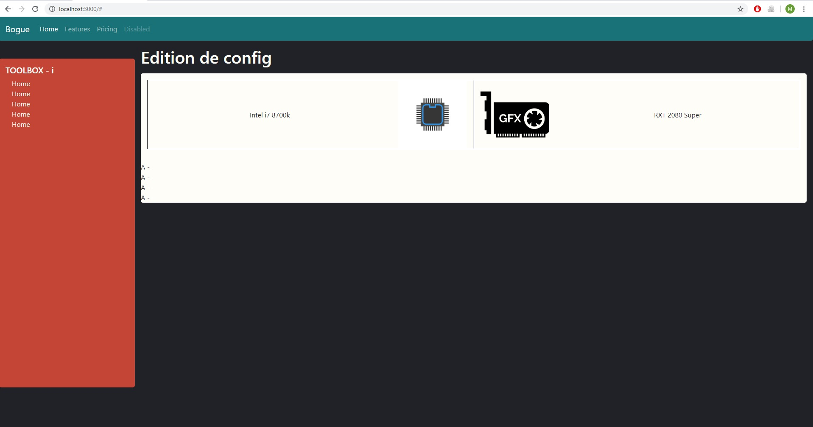

This project was bootstrapped with [Create React App](https://github.com/facebook/create-react-app).

# Bogue

Bogue est un projet de site communautaire, ou les utilisateurs sont invités à partager des configurations d’ordinateur.
Afin de simplifier l’utilisation, de permettre un suivi et la remonté d'information automatisé, les configurations serons saisi via une interface graphique.
Le but à terme serait de pouvoir donner des indications, automatisé et/ou de la part de la communauté, sur l’équilibrage d’une configuration lors de l'édition de cette dernière. Que ce soit grace à des statistiques bruts ou des analyses plus complexes basées sur les données chiffrées des composants sélectionnés.

## Roadmap et fonctionnalités

### Done

- Initialiser le projet en React/Bootstrap
- Faire un readme pertinant (à entretenir)

### In progress

- Fixer l'ergonomie générale du site
- Faire la barre de navigation
- Faire la page de création de configuration
- S'amuser en apprenant React

### TODO

- Mise en place d'un système de routage
- Faire la page de création de composant
- Faire la page d'acceuil
- Faire la page profil / système de connexion
- Ajouter des statistiques de performance
- Mettre en place un backoffice / persistance centralisé
- Ajouter un chat / système de commentaire
- Internationnaliser
- Faire du contenu

## Audio description

Une description de ce qui est attendu graphiquement et fonctionnellement des différentes pages de l'application.

### Edition de config

Cette page permet à l'utilisateur de définir une configuration pc. 

Un "menu verticale" sur la gauche (toolbox) permettant de sauvegarder (local/externe) et de partager. Mais aussi en fonction de l'espace qu'il reste de donner des informations globale comme : le prix de la configuration, le niveau de performances attendu / un système de ranking des config -> Une image/Gif ?, liens vers des configurations similaires, le chat (?)(miniaturisable dans le bas de la toolbox (une fenêtre a la conversation Facebook ?))

Sur le reste de l'écran, un premier bandeau horizontal fait ressortir les zones processeur et carte graphique. Puis en dessous une liste non fixe d'élément à ajouter.

Quand on clique sur la zone d'une caractéristique, une bande s'ouvre sous la zone permettant de rechercher le produit en question

Évolutions futures : 
- bouton pour passer en mode conception -> ajout de conseils d'achat.

## Available Scripts

In the project directory, you can run:

### `npm start`

Runs the app in the development mode. 
Open [http://localhost:3000](http://localhost:3000) to view it in the browser.

The page will reload if you make edits. 
You will also see any lint errors in the console.

### `npm test`

Launches the test runner in the interactive watch mode. 
See the section about [running tests](https://facebook.github.io/create-react-app/docs/running-tests) for more information.

### `npm run build`

Builds the app for production to the `build` folder. 
It correctly bundles React in production mode and optimizes the build for the best performance.

The build is minified and the filenames include the hashes. 
Your app is ready to be deployed!

See the section about [deployment](https://facebook.github.io/create-react-app/docs/deployment) for more information.

### `npm run eject`

**Note: this is a one-way operation. Once you `eject`, you can’t go back!**

If you aren’t satisfied with the build tool and configuration choices, you can `eject` at any time. This command will remove the single build dependency from your project.

Instead, it will copy all the configuration files and the transitive dependencies (Webpack, Babel, ESLint, etc) right into your project so you have full control over them. All of the commands except `eject` will still work, but they will point to the copied scripts so you can tweak them. At this point you’re on your own.

You don’t have to ever use `eject`. The curated feature set is suitable for small and middle deployments, and you shouldn’t feel obligated to use this feature. However we understand that this tool wouldn’t be useful if you couldn’t customize it when you are ready for it.

## Learn More

You can learn more in the [Create React App documentation](https://facebook.github.io/create-react-app/docs/getting-started).

To learn React, check out the [React documentation](https://reactjs.org/).

### Code Splitting

This section has moved here: https://facebook.github.io/create-react-app/docs/code-splitting

### Analyzing the Bundle Size

This section has moved here: https://facebook.github.io/create-react-app/docs/analyzing-the-bundle-size

### Making a Progressive Web App

This section has moved here: https://facebook.github.io/create-react-app/docs/making-a-progressive-web-app

### Advanced Configuration

This section has moved here: https://facebook.github.io/create-react-app/docs/advanced-configuration

### Deployment

This section has moved here: https://facebook.github.io/create-react-app/docs/deployment

### `npm run build` fails to minify

This section has moved here: https://facebook.github.io/create-react-app/docs/troubleshooting#npm-run-build-fails-to-minify

## Prévisualisation

